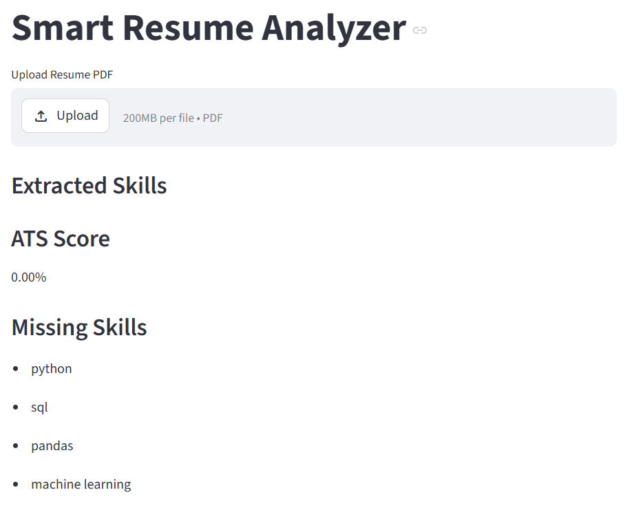
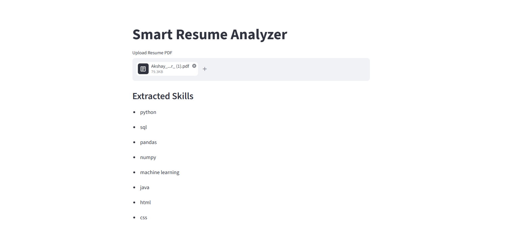

# Smart Resume Analyzer

## Overview
Smart Resume Analyzer is a Python-based application that analyzes resumes using NLP preprocessing, skill extraction, ATS scoring, and visualization techniques.

## Features
- Resume PDF upload
- Skill extraction
- ATS score calculation
- Missing skill detection
- Resume analytics visualization
- Interactive Streamlit frontend

## Technologies Used
- Python
- Streamlit
- Pandas
- Matplotlib
- pdfplumber
- Regex

## Workflow
1. Resume Upload
2. PDF Text Extraction
3. Text Preprocessing
4. Skill Extraction
5. ATS Score Calculation
6. Missing Skill Analysis
7. Visualization

## Project Structure
```text
app/
data/
images/
notebooks/
README.md
```

## Future Improvements
- AI-based resume recommendations
- Job recommendation system
- Learning path suggestions
- Advanced NLP models
- Resume ranking system

## Screenshots

### Home Page



### Extracted Skills



## Final Insights

- Resume automation can significantly reduce recruiter workload.
- ATS scoring helps shortlist candidates efficiently.
- Missing skill analysis identifies candidate improvement areas.
- Visualization improves resume interpretation and hiring decisions.
- Automation systems improve scalability in large hiring processes.

## Business Value

This project helps automate resume screening using NLP preprocessing, skill extraction, ATS scoring, and visualization techniques. It reduces manual recruiter effort and improves candidate shortlisting efficiency during large-scale hiring.